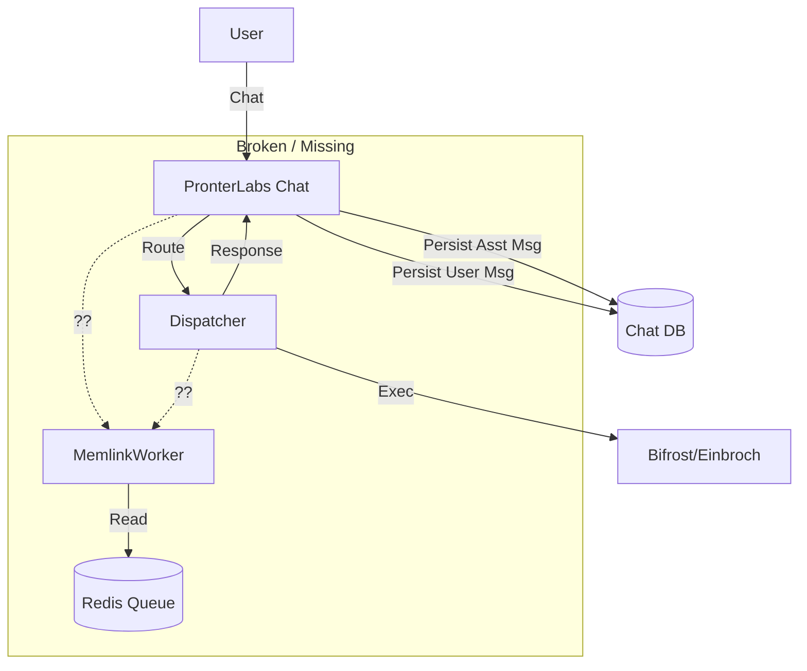

# Current State Architecture (Audit Phase)

**Date:** 2026-01-22
**Status:** Fragmented / Disconnected

## 1. Chat Persistence (`pronterlabs-chat`)
- **Mechanism:** HTTP POST to `/api/chat` (Next.js App Router).
- **Database:** Connects to `pronterlabs_chat` (Postgres) on `memlink-postgres`.
- **Flow:**
  1.  Starts Transaction (`BEGIN`).
  2.  Inserts/Gets Conversation.
  3.  Inserts User Message.
  4.  Commits (`COMMIT`).
  5.  Calls Dispatcher API (`/v1/chat/completions`).
  6.  Receives Response.
  7.  **Separately** Inserts Assistant Message (New Transaction).
- **Critical Flaw:** Assistant message persistence is disjoint from user message. If step 7 fails, the chat log is incomplete. No retry mechanism exists.

## 2. Dispatcher (`dispatcher`)
- **Role:** pure Router / Orchestrator.
- **Persistence:** None. Does not save chat history.
- **Ingestion Trigger:** **None**. Dispatcher does NOT call Memlink or push to any queue.
- **Context Injection:** Injects facts into LLM context if available, but does not trigger new fact extraction.

## 3. Memlink (`memlink`)
- **Mechanism:** Worker process listening on Redis Stream `memlink:job_stream`.
- **Ingestion Source:** **Missing**. Nothing in the current codebase pushes to this stream during the chat loop.
- **Persistence:** Has its own `memlink` DB for facts/summaries, but relies on external triggers to populate it.

## 4. Summary of Data Flow

