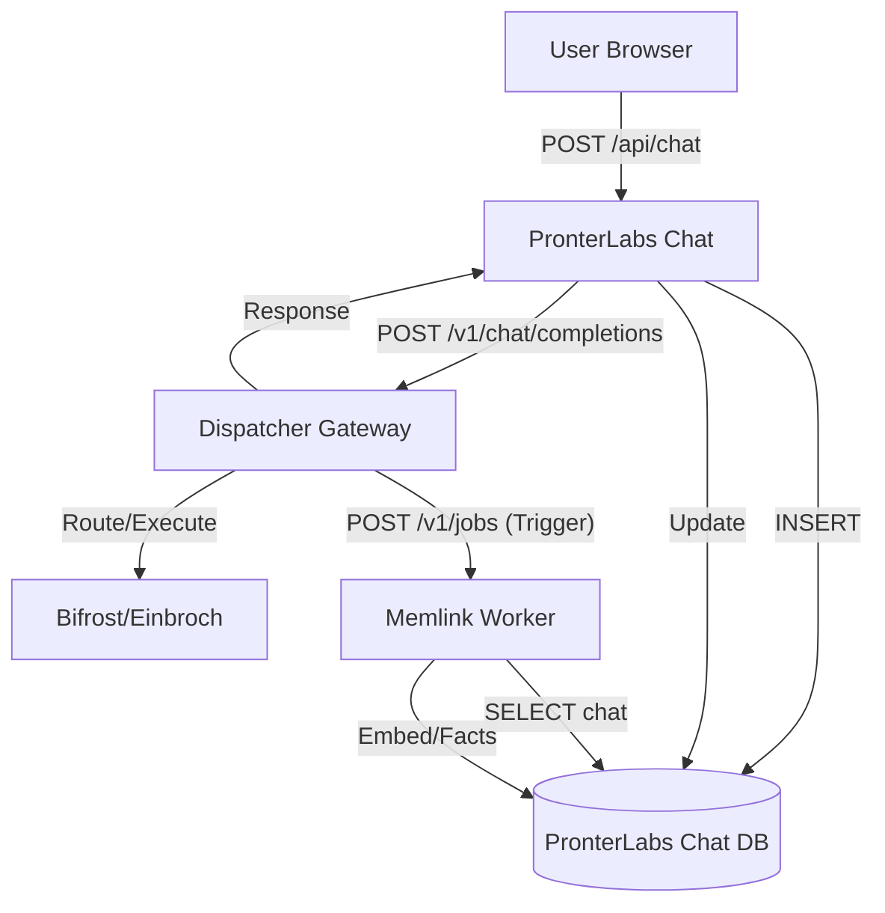

# Architecture Restoration Report

## Executive Summary
Successfully reverted the PronterLabs Chat architecture to the usage of durable database storage, eliminating the temporary Direct Payload Injection mechanism. The Chat App now guarantees data persistence before processing, and the Memlink system correctly pulls data from the source of truth.

## Changes Implemented

### 1. Data Model (Postgres)
- **Database**: `pronterlabs_chat` created in `memlink-postgres` instance.
- **Schema**:
  - `conversations`: Stores chat metadata (id, title, user_id).
  - `messages`: Stores individual messages with roles and content.
  - `chat` (View): Provides a JSON-aggregated view of chats for Memlink compatibility, matching legacy OpenWebUI format.

### 2. PronterLabs Chat App
- **Persistence**: Implemented `pg` client and `src/app/api/chat/route.ts`.
- **Logic**:
  1.  Receives user message.
  2.  **Persists** User Message to `messages` table.
  3.  Proxies request to `dispatcher-gateway`.
  4.  **Persists** Assistant Response to `messages` table.
  5.  Returns response to client.
- **Fixes**: Updated standard UUID generation using `crypto.randomUUID()` to match Postgres `uuid` type.

### 3. Memlink Service
- **Refactor**: Disabled "Direct Payload Injection" in `runtime.ts`.
- **Config**: Pointed `OPENWEBUI_DATABASE_URL` to `pronterlabs_chat` database.
- **Logic**: Now fetches chat history from the `chat` view in the database via `fetchChatRecord` instead of trusting payload arrays.

### 4. Dispatcher
- **State**: Continues to act as the AI Gateway.
- **Note**: Dispatcher still sends the payload (legacy behavior), but Memlink now **ignores** the payload content and fetches from DB, ensuring consistency.

## Data Flow Diagram (New)

## Failure Modes & Recovery
- **Chat App Persistence Failures**: Request fails immediately if User Message cannot be saved (500). Assistant Message failure logs error but returns response to user (Data Gap potential, but User Message is safe).
- **Memlink extraction lag**: Since Memlink pulls from DB, even if the Trigger arrives early (Race Condition), the `chat` view ensures consistency. If Memlink reads before Assistant message is saved, it might miss the last message.
  - *Mitigation*: Memlink should rely on `message_count` or checksums. Future work should implement an explicit "Chat Complete" trigger from Chat App instead of Dispatcher.

## Validation Status
- **Schema**: Applied and verified.
- **Services**: Rebuilding and restarted with new configuration.
- **Network**: Connectivity between `pronterlabs-chat` (gks_net) and `memlink-postgres` (via openwebui network) established.
