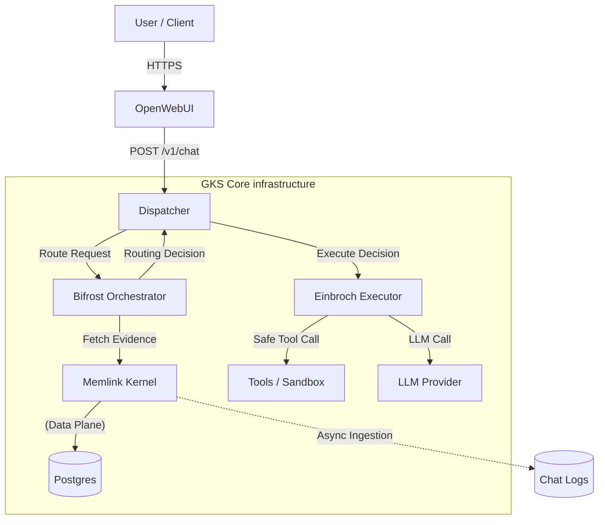

# System Architecture

GKS architecture follows a **Control Plane / Data Plane** separation pattern, wrapped in a gateway architecture for external compatibility.

## Logical Architecture

### 1. The Gateway Layer
*   **Role**: Compatibility & Adaptation.
*   **Component**: **Dispatcher**.
*   **Function**: Accepts standard input (OpenAI Protocol), adapts it to the internal GKS Domain Model (Context, Intent), and maps responses back to standard outputs. It creates the "Identity Context" for the AI.

### 2. The Control Plane
*   **Role**: Governance & Orchestration.
*   **Components**: **Bifrost**, **Einbroch**.
*   **Function**:
    *   **Bifrost**: The "Brain". Decides *what* to do. It classifies intent, consults policy, checks permissions, and generates a binding **Routing Decision**.
    *   **Einbroch**: The "Hands". Do *what* is decided. It executes the decision statelessly, enforcing fail-closed safety on tool usage.

### 3. The Data Plane
*   **Role**: Authorization & Persistence.
*   **Component**: **Memlink**.
*   **Function**: The "Memory". It ingests chat streams, extracts authoritative facts using background workers, and serves them via evidence-gated APIs. It owns the "Truth" of the system.

### 4. The Presentation Layer
*   **Role**: User Interaction.
*   **Component**: **OpenWebUI**.
*   **Function**: Renders the chat interface, manages user sessions, and sends requests to the Gateway.

---

## Architecture Diagram

