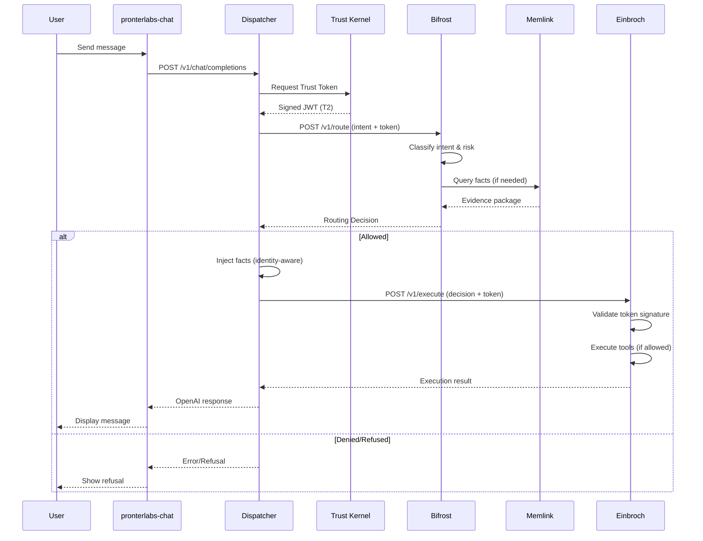

# PronterLabs System Architecture Overview

## Executive Summary
PronterLabs (formerly GKS - Cognitive Grid System) is a production-grade **AI Agent Platform** built on 6 core pillars that work together to provide secure, auditable, and memory-aware AI interactions. The system enforces strict security policies, maintains authoritative memory, and provides OpenAI-compatible APIs for seamless integration.

---

## The 6 Pillars

### 1. **pronterlabs-chat** (Frontend)
**Technology**: Next.js 14, React, TypeScript, TailwindCSS  
**Purpose**: User-facing chat interface with enterprise authentication

**Key Features**:
- Modern, responsive chat UI
- OIDC authentication (via `react-oidc-context`)
- Direct integration with Dispatcher's OpenAI-compatible API
- PostgreSQL-backed chat persistence
- PWA support for offline capability

**Location**: `/home/marek/pronterlabs/pronterlabs-chat`

---

### 2. **Dispatcher** (API Gateway)
**Technology**: Python, FastAPI  
**Purpose**: OpenAI-compatible bridge to the Cognitive Grid backend

**Key Responsibilities**:
- Exposes `/v1/chat/completions` (OpenAI format)
- Orchestrates RAG workflows
- Identity-aware fact injection ("User" → "You")
- Trust Token management
- Routes requests through Bifrost → Einbroch

**Flow**:
```
Client → Dispatcher → Trust Kernel (get token) → Bifrost (route) → Einbroch (execute) → Response
```

**Location**: `/home/marek/pronterlabs/dispatcher`

---

### 3. **Bifrost** (Intent Router & Policy Engine)
**Technology**: Python, FastAPI  
**Purpose**: The **control plane** that decides what should happen next

**Core Functions**:
- Intent classification (factual, creative, precision-required, etc.)
- Risk assessment (low, medium, high)
- Policy enforcement (tenant, role, trust tier)
- Memory access control (none, facts_only, summary)
- Agent selection
- Tool authorization with constraints

**Key Principle**: Bifrost **never executes** - it only produces routing decisions that downstream services must follow.

**Trust Integration**: Validates Trust Tokens and enforces tier-based permissions (T0-T3).

**Location**: `/home/marek/pronterlabs/bifrost`

---

### 4. **Trust Kernel** (Authentication & Authorization)
**Technology**: Python, FastAPI  
**Purpose**: Root of Trust for the entire system

**Responsibilities**:
- Issues cryptographically signed **Trust Tokens** (RS256 JWT)
- Defines and enforces **Trust Tiers**:
  - **T0** (System/Root): Full access
  - **T1** (Verified/Admin): High-risk tools allowed
  - **T2** (Asserted/User): Standard user, low-risk only
  - **T3** (Inferred/Agent): Minimal privilege
- Manages escalation workflows (Human-in-the-Loop)

**Security Model**: All downstream services validate token signatures before execution.

**Location**: `/home/marek/pronterlabs/trust-kernel`

---

### 5. **Einbroch** (Executor)
**Technology**: Python, FastAPI, Poetry  
**Purpose**: Stateless execution service that faithfully executes Bifrost decisions

**Core Invariants**:
- **Trust Verified**: Validates Trust Tokens before any action
- **Binding Decisions**: Never second-guesses Bifrost
- **Stateless**: No database, all context in request
- **Fail-Closed**: Invalid schema/evidence = immediate rejection
- **Safe Execution**: Whitelisted tools only

**Current Phase**: Phase 2 (Hard Enforcement with RS256)

**Location**: `/home/marek/pronterlabs/einbroch`

---

### 6. **Memlink** (Memory Authority)
**Technology**: Node.js, TypeScript, PostgreSQL, Redis  
**Purpose**: Authoritative memory service for AI agents

**Architecture**:
- **Watcher**: Monitors chat database for new messages
- **Worker**: Executes LLM jobs (summarization, fact extraction)
- **API**: Retrieval endpoints with evidence gating
- **Relay**: Event pipeline orchestration

**Key Features**:
- Real-time summarization (<60s)
- Authoritative fact extraction
- Trust provenance (signer_id, trust_tier)
- Evidence gating (refuses precision queries without verified facts)
- Multi-tenant isolation (shared `tenant_db` with `tenant_id` scoping + RLS)
- Provider agnostic (OpenAI, Gemini, Ollama)
- GraphRAG support

**Security**: Row Level Security (RLS) enforced via restricted `memlink_app` role (not superuser).

**Location**: `/home/marek/pronterlabs/memlink`

---

## Complete Request Flow



---

## Key Design Principles

### 1. **Evidence-First**
- Memlink refuses to answer precision queries without verified evidence
- Bifrost enforces evidence requirements based on intent classification
- No hallucinations for critical data (passwords, IDs, configs)

### 2. **Trust-Aware**
- Every request carries a Trust Token
- Services validate tokens before execution
- Tier-based permissions (T0-T3)

### 3. **Fail-Closed**
- Invalid tokens → deny
- Missing evidence → refuse
- Schema violations → reject

### 4. **Stateless Execution**
- Einbroch has no database
- All context provided in request
- Enables horizontal scaling

### 5. **Multi-Tenant Isolation**
- Memlink: RLS + separate schemas
- Bifrost: Tenant-aware policies
- Trust Kernel: Tenant-scoped tokens

---

## Authentication Flow

### Frontend (pronterlabs-chat)
1. User accesses chat UI
2. OIDC redirect to **auth-pront** (Authentik)
3. User authenticates
4. Redirect back with auth code
5. Exchange for ID token
6. Store session, access chat

### Backend (Dispatcher → Services)
1. Dispatcher requests Trust Token from Trust Kernel
2. Trust Kernel validates caller (shared secret/mTLS)
3. Issues signed JWT with user_id, tenant_id, trust_tier
4. Dispatcher passes token in `X-Trust-Token` header
5. Downstream services validate signature

---

## Database Architecture

### Memlink Database (`pronterlabs_chat`)
**Tables**:
- `memlink_chat_summaries`: Hierarchical chat summaries
- `memlink_memory_facts`: Extracted, verified facts
- `memlink_embeddings`: Vector embeddings for semantic search
- `memlink_graph_nodes/edges`: GraphRAG knowledge graph
- `memlink_tenants`: Tenant registry
- `memlink_tenant_mappings`: User/chat → tenant mapping

**Security**: 
- RLS enabled on sensitive tables
- `FORCE ROW LEVEL SECURITY` applied
- Application runs as `memlink_app` (restricted role, not superuser)

### Chat Database
- Stores raw chat messages
- Monitored by Memlink Watcher
- Triggers summarization pipeline

---

## Technology Stack

| Component | Language | Framework | Database | Auth |
|-----------|----------|-----------|----------|------|
| pronterlabs-chat | TypeScript | Next.js 14 | PostgreSQL | OIDC |
| Dispatcher | Python | FastAPI | - | Trust Token |
| Bifrost | Python | FastAPI | - | Trust Token |
| Trust Kernel | Python | FastAPI | - | Shared Secret |
| Einbroch | Python | FastAPI | - | Trust Token |
| Memlink | TypeScript | Node.js | PostgreSQL, Redis | Trust Token |

---

## Deployment

All services run as Docker containers orchestrated via `docker-compose`:
- **pronterlabs-chat**: Port 3000 (frontend)
- **Dispatcher**: Port 8003 (OpenAI API)
- **Bifrost**: Port 8001
- **Trust Kernel**: Port 8004
- **Einbroch**: Port 8000
- **Memlink API**: Port 3002
- **Memlink Worker**: Background service
- **Memlink Relay**: Event pipeline

---

## Current Status

### Production-Ready
- ✅ Memlink: Summarization, Facts, Vector Search, Multi-Tenancy, GraphRAG
- ✅ Trust Kernel: Phase 2 (Hard Enforcement, RS256)
- ✅ Bifrost: Intent routing, Policy enforcement
- ✅ Einbroch: Stateless execution, Trust validation
- ✅ Dispatcher: OpenAI compatibility, RAG orchestration

### Recent Hardening (Jan 2026)
- ✅ Fixed RLS bypass (superuser → restricted role)
- ✅ Applied `FORCE ROW LEVEL SECURITY`
- ✅ Verified strict tenant isolation

---

## Next Steps for New Developers

1. **Read the docs**:
   - Each pillar has detailed docs in `docs/` subdirectories
   - Start with Bifrost's `architecture.md` for the big picture

2. **Run locally**:
   ```bash
   cd /home/marek/pronterlabs/memlink
   docker compose up -d
   ```

3. **Verify health**:
   ```bash
   curl http://localhost:3002/health  # Memlink
   curl http://localhost:8001/health  # Bifrost
   curl http://localhost:8000/health  # Einbroch
   curl http://localhost:8004/health  # Trust Kernel
   ```

4. **Test E2E**:
   - Access chat UI: `http://localhost:3000`
   - Send a message
   - Verify facts extracted in Memlink DB

5. **Study the flow**:
   - Enable debug logging in Dispatcher
   - Send a request
   - Trace through logs: Dispatcher → Trust Kernel → Bifrost → Memlink → Einbroch

---

## Key Repositories

- **Memlink**: `/home/marek/pronterlabs/memlink`
- **Bifrost**: `/home/marek/pronterlabs/bifrost`
- **Dispatcher**: `/home/marek/pronterlabs/dispatcher`
- **Trust Kernel**: `/home/marek/pronterlabs/trust-kernel`
- **Einbroch**: `/home/marek/pronterlabs/einbroch`
- **Frontend**: `/home/marek/pronterlabs/pronterlabs-chat`
- **Auth**: `/home/marek/pronterlabs/auth-pront` (Authentik)
